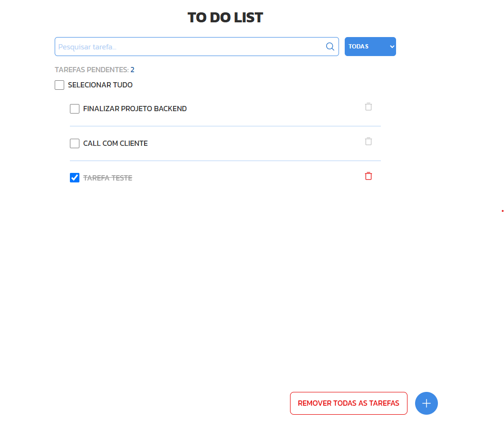

# To-Do List

Uma aplicação simples de lista de tarefas desenvolvida com React e Vite.

## 📋 Funcionalidades

- Adicionar tarefas à lista.
- Marcar tarefas como concluídas.
- Remover tarefas da lista.
- Pesquisar tarefas adicionadas.
- Armazenamento das tarefas no localStorage
- Filtro para visualizar tarefas concluídas, pendentes ou todas
- Interface responsiva, adaptada para dispositivos móveis

## 🚀 Tecnologias Utilizadas

- React
- Vite
- ESLint

